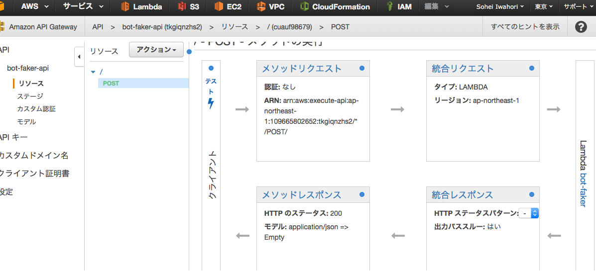

# 合宿

## やろうとしたこと

 - [done]botの受け側の整備
  - ua出す
 - [done]botをキックする奴
  - [done]apigateway
  - `curl -v -H "Accept: application/json" -H "Content-type: application/json" -X POST -d '{"to": "u6f27bae0d2XXXXXXXXXXXXXXXXXXXXXX", "text":"あああ"} https://tkgiqnzhs2.execute-api.ap-northeast-1.amazonaws.com/production`
  - [done]雑にリクエスト投げるらむだ
 - ついでに色々試す ip、スペック調査など
  - [done]globalip -> 3時間くらいでかわる
  - [done]スペック、ローカルIP
 - js力
  - 同期的処理の書き方など
  - コールバック
 - bot
  - [done]任意の発言用
  - 画像系とか試してみる？
  - アイドルとか？


## botの方

```
honduras-2:eg2mix-bot egmc$  tree -I vendor
.
├── bot.php
├── composer.json
├── composer.lock
├── credential.yml
├── lib
│   └── E2MBot
│       ├── Responder
│       │   ├── CoopResponder.php
│       │   ├── HelpResponder.php
│       │   ├── ShoppingAddResponder.php
│       │   ├── ShoppingResponder.php
│       │   ├── TextResponder.php
│       │   └── WasshoiResponder.php
│       ├── Responder.php
│       └── ResponderInterface.php
├── logs
├── public
│   ├── callback.php
│   └── test.php
└── responders.yml

```

responders.yml
```yaml
default: 'Help'
map:
  - pattern: '^(か|買)(い|う)(物|もの)'
    responder: 'Shopping'
    basic: "かいもの"
    desc: "買い物リストを表示"
  - pattern: '^(か|買)う( |　).+'
    responder: 'ShoppingAdd'
    basic: "かう {text}"
    desc: '{text}を買い物リストに追加するよ'
  - pattern: '^(コープ|coop|こーぷ)'
    responder: 'Coop'
    basic: "こーぷ"
    desc: "コープさんを表示"
  - pattern: '^say( |　).*'
    responder: 'Text'
    basic: "say {text}"
    desc: '{text}を表示するよ'
  - pattern: 'あーりん'
    responder: 'Wasshoi'
    basic: "あーりん"
    desc: 'わっしょい'
```

```php
<?php
namespace E2MBot\Responder;

use \E2MBot\Responder;

class WasshoiResponder extends Responder
{
    public function response(){
        $this->sendTextResponse('わっしょい');
    }
}
```

## lambda＆api gatewayの方

bot-faker（lineからのリクエストっぽいのを投げるやつ）
```js
'use strict';

var Faker = {};
Faker.createParam = function(to, text) {
    var dummy_req = {
        "result": [
            {
                "toChannel": 1461690851,
                "to": [
                    "xxx"
                ],
                "id": "WB1520-3472426954",
                "fromChannel": 1341301815,
                "from": "",
                "eventType": "138311609000106303",
                "createdTime": 1464422717466,
                "content": {
                    "seq": null,
                    "contentType": 1,
                    "deliveredTime": 0,
                    "toType": 1,
                    "createdTime": 1464422717448,
                    "from": "u6f27bae0d2XXXXXXXXXXXXXXXXXXXXXX",
                    "location": null,
                    "id": "4379663030496",
                    "to": [
                        "u06b53eXXXXXXXXXXXXXXXXXXXXXXXXXX"
                    ],
                    "text": "",
                    "contentMetadata": {
                        "SKIP_BADGE_COUNT": "true",
                        "AT_RECV_MODE": "2"
                    }
                }
            }
        ]
    };

    dummy_req.result[0].content.text = text;
    dummy_req.result[0].content.from = to;
    return dummy_req;
};


exports.handler = function(event, context) {

    var request = require('request');

    var endPoint = 'https://ssl.eg2mix.com/callback.php';

    console.log(JSON.stringify(event));

    var dummy_req = Faker.createParam(event.to, event.text);

    request({
        url: endPoint,
        method: 'POST',
        headers: {
            'User-Agent': 'bot-faker'
        },
        body: JSON.stringify(dummy_req)
    }, function (error, response, body) {
        if (error) console.log(error);
        console.log(body);
        context.succeed(true);
    });
};

```

↑を叩くためのapi gatewayを作成
api gatewayを経由してパラメータを渡す



coop-sender/index.js
```js
'use strict';

exports.handler = function(event, context) {

    var request = require('request');

    // api gateway endpoint
    var endPoint = 'https://tkgiqnzhs2.execute-api.ap-northeast-1.amazonaws.com/production';

    console.log(JSON.stringify(event));

    var params =[
        {
            "to": "u6f27bae0d2XXXXXXXXXXXXXXXXXXXXXX",  //me
            "text": "say 今週のコープさんをお知らせします"
        },
        {
            "to": "u6f27bae0d2XXXXXXXXXXXXXXXXXXXXXX",
            "text": "こーぷ"
        },
        {
            "to": "u8f0351XXXXXXXXXXXXXXXXXXXXXXXXXX",  //tomo
            "text": "say 今週のコープさんをお知らせします"
        },
        {
            "to": "u8f0351XXXXXXXXXXXXXXXXXXXXXXXXXX",
            "text": "こーぷ"
        }
    ];

    params.forEach(function(param){
        request({
            url: endPoint,
            method: 'POST',
            body: JSON.stringify(param)
        }, function (error, response, body) {
            if (error) console.log(error);
            console.log(body);
            context.succeed(true);
        });
    });
};

```
これをlambdaのcron実行で月曜日に実行すると通知が届く

## lambda色々

どの程度インスタンスが入れ替わるのか、信頼性はどうなのかというところで気になったのでちょっと調べてみた


1分ごとに実行してIPの変化

```
[eg@yemen logs]$ cat lambda.log |grep ^52 | uniq -c
    170 52.193.143.241
    231 52.196.216.135
    172 52.196.5.217
    225 52.69.206.172
     97 52.193.23.42
[eg@yemen logs]$ cat lambda.log |grep ^52 | wc -l
895
```

3時間ぐらいで変わってるっぽい

スペック
```json
{
  "networkInterfaces": {
    "vsb_4": [
      {
        "internal": false,
        "family": "IPv4",
        "address": "169.254.76.7"
      }
    ],
    "lo": [
      {
        "internal": true,
        "family": "IPv4",
        "address": "127.0.0.1"
      }
    ]
  },
  "hostname": "ip-10-12-42-28",
  "type": "Linux",
  "release": "4.1.19-24.31.amzn1.x86_64",
  "uptime": 8550.362299808,
  "loadavg": [
    0.0029296875,
    0.0146484375,
    0.04541015625
  ],
  "totalmem": 3950559232,
  "freemem": 3323461632,
  "cpus": [
    {
      "times": {
        "irq": 0,
        "idle": 85135500,
        "sys": 27800,
        "nice": 0,
        "user": 55100
      },
      "speed": 2800,
      "model": "Intel(R) Xeon(R) CPU E5-2680 v2 @ 2.80GHz"
    },
    {
      "times": {
        "irq": 0,
        "idle": 85279400,
        "sys": 28600,
        "nice": 0,
        "user": 85800
      },
      "speed": 2800,
      "model": "Intel(R) Xeon(R) CPU E5-2680 v2 @ 2.80GHz"
    }
  ]
}
```

hostnameとuptime

```
[eg@yemen logs]$  cat lambda_test.txt | jq -r '.hostname + "\t" + (.uptime|tostring)'
ip-10-12-42-28	8550.362299808
ip-10-12-42-28	8608.2723575
ip-10-12-42-28	8668.20501534
ip-10-12-42-28	8728.286511668
ip-10-12-42-28	8788.20435786
ip-10-12-42-28	8847.58309619
ip-10-12-42-28	8908.442249888
ip-10-12-42-28	8967.682972511
ip-10-12-42-28	9027.568419588
ip-10-12-42-28	9088.735602094
ip-10-12-42-28	9147.650701359
ip-10-12-42-28	9207.67583891
ip-10-12-42-28	9267.725449387
ip-10-12-42-28	9328.291513382
ip-10-12-42-28	9387.820190765
ip-10-12-42-28	9447.982593553
ip-10-12-42-28	9508.050010122
ip-10-12-42-28	9567.015747096
ip-10-12-42-28	9629.07580676
ip-10-12-42-28	9688.17702124
ip-10-12-42-28	9747.187195911
ip-10-12-42-28	9808.166854339
ip-10-12-42-28	9867.255928924
ip-10-12-42-28	9928.398250354
ip-10-12-42-28	9988.468926957
ip-10-12-42-28	10047.573284943
ip-10-12-42-28	10108.505005051
ip-10-12-42-28	10167.814403935
ip-10-12-42-28	10227.468615543
ip-10-12-42-28	10289.386833281
ip-10-12-42-28	10347.76489393
ip-10-12-42-28	10407.832686505
ip-10-12-42-28	10467.873838001
ip-10-12-42-28	10528.13288396
ip-10-12-42-28	10586.916433713
ip-10-12-42-28	10648.118149344
ip-10-12-42-28	10708.101186353
ip-10-12-42-28	10767.12190212
ip-10-12-42-28	10828.273394053
ip-10-12-42-28	10887.194320197
ip-10-12-42-28	10948.310194425
ip-10-12-42-28	11008.070368186
ip-10-12-42-28	11067.560586363
ip-10-12-42-28	11127.921265182
ip-10-12-42-28	11187.628901893
ip-10-12-42-28	11247.594442133
ip-10-12-42-28	11307.803145227
ip-10-12-42-28	11368.136116632
ip-10-12-42-28	11427.995621408
ip-10-12-42-28	11487.747651012
ip-10-12-42-28	11547.933346152
ip-10-12-42-28	11607.952245548
ip-10-12-42-28	11667.650475949
ip-10-12-42-28	11727.888727013
ip-10-12-42-28	11787.745345159
ip-10-12-42-28	11847.599935038
ip-10-12-42-28	11907.284365969
ip-10-12-42-28	11967.697418458
ip-10-12-42-28	12028.110815962
ip-10-12-42-28	12087.253184494
ip-10-12-42-28	12148.291970115
ip-10-12-42-28	12207.673404106
ip-10-12-42-28	12268.509548409
ip-10-12-42-28	12327.693932647
ip-10-12-42-28	12387.338966087
ip-10-12-42-28	12447.727770141
ip-10-12-42-28	12507.884186617
ip-10-12-42-28	12567.929055048
ip-10-12-42-28	12627.924757614
ip-10-12-42-28	12687.221375686
ip-10-12-42-28	12747.970876573
ip-10-12-42-28	12807.873793767
ip-10-12-42-28	12867.782250095
ip-10-12-42-28	12928.186122603
ip-10-12-42-28	12988.446871864
ip-10-12-42-28	13048.485424013
ip-10-12-42-28	13106.929982852
ip-10-12-42-28	13168.099445145
ip-10-12-42-28	13228.827122309
ip-10-12-42-28	13287.218876173
ip-10-12-42-28	13348.378393018
ip-10-12-42-28	13408.484339577
ip-10-12-42-28	13467.640279579
ip-10-12-42-28	13527.705954594
ip-10-12-42-28	13587.428675277
ip-10-12-42-28	13648.034953842
ip-10-12-42-28	13706.990517108
ip-10-12-42-28	13767.617651605
ip-10-12-42-28	13828.320430574
ip-10-12-42-28	13887.674141312
ip-10-12-42-28	13947.701962718
ip-10-12-42-28	14008.445838604
ip-10-12-42-28	14067.533214368
ip-10-12-42-28	14128.234019713
ip-10-12-42-28	14188.114253895
ip-10-12-42-28	14247.381378078
ip-10-12-42-28	14307.780694465
ip-10-12-42-28	14367.405981611
ip-10-12-42-28	14427.563714894
ip-10-12-49-252	3302.602555093
ip-10-12-49-252	3359.80774053
ip-10-12-49-252	3418.757442602
ip-10-12-49-252	3479.320653904
ip-10-12-49-252	3540.300125496
ip-10-12-49-252	3599.483685067
ip-10-12-49-252	3660.064638232
ip-10-12-49-252	3718.657819472
ip-10-12-49-252	3779.383249073
ip-10-12-49-252	3840.166937938
ip-10-12-49-252	3899.313267167
ip-10-12-49-252	3959.362953533
ip-10-12-49-252	4019.411836255
ip-10-12-49-252	4079.385929249
ip-10-12-49-252	4140.299989669
ip-10-12-49-252	4199.444769091
ip-10-12-49-252	4259.439150613
ip-10-12-49-252	4318.591659318
ip-10-12-49-252	4379.270935061
ip-10-12-49-252	4439.577007602
ip-10-12-49-252	4499.225356535
ip-10-12-49-252	4559.950512304
ip-10-12-49-252	4620.023886976
ip-10-12-49-252	4679.48289831
ip-10-12-49-252	4739.32842286
ip-10-12-49-252	4799.385600096
ip-10-12-49-252	4859.528366985
ip-10-12-49-252	4920.334569397
ip-10-12-49-252	4979.610149842
ip-10-12-49-252	5039.287445621
ip-10-12-49-252	5099.843859931
ip-10-12-49-252	5159.987052366
ip-10-12-49-252	5219.952784535
ip-10-12-49-252	5279.005771475
ip-10-12-49-252	5340.103447056
ip-10-12-49-252	5399.833607108
ip-10-12-49-252	5459.801651585
ip-10-12-49-252	5519.762011373
ip-10-12-49-252	5578.906010824
ip-10-12-49-252	5639.965045479
ip-10-12-49-252	5700.435247086
ip-10-12-49-252	5759.400707364
ip-10-12-49-252	5819.945955256
ip-10-12-49-252	5878.956370211
ip-10-12-49-252	5939.337878169
ip-10-12-49-252	5999.494073478
ip-10-12-49-252	6059.471016368
ip-10-12-49-252	6120.412492242
ip-10-12-49-252	6179.563675109
ip-10-12-49-252	6239.721895998
ip-10-12-49-252	6299.611342243
ip-10-12-49-252	6359.695393238
ip-10-12-49-252	6418.810855224
ip-10-12-49-252	6479.823445665
ip-10-12-49-252	6539.966941053
ip-10-12-49-252	6598.96378117
ip-10-12-49-252	6659.968022624
ip-10-12-49-252	6719.441924874
ip-10-12-49-252	6779.080958416
ip-10-12-49-252	6840.089240898
ip-10-12-49-252	6899.141454664
ip-10-12-49-252	6960.175990292
ip-10-12-49-252	7019.167822667
ip-10-12-49-252	7080.146750635
ip-10-12-49-252	7140.429874436
ip-10-12-49-252	7199.579197892
```
同じサーバが一定時間割り当てられるっぽい

## lambdaで何をするか？

 - バッチの代わり->バッチは冗長化とかめんどい
 - ちょっとしたAPIの提供
 - AWSのAPIを利用したツール（自動スナップショットとか、イベントフックで何かをするものとか、情報収集系とか
 - 雑に扱えるマシンリソース
